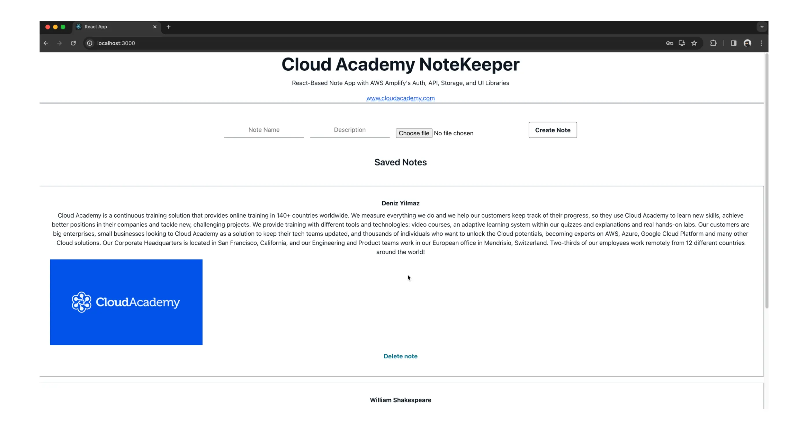

<h1 align="center">NoteKeeper App - AWS Amplify & React</h1>

NoteKeeper is a full-stack React application that demonstrates integrating AWS Amplify to provide a robust backend. It features authentication, API interactions, and storage solutions using Amazon Cognito, DynamoDB, and S3.

### Prerequisites
Ensure you have the latest versions of Node.js and npm installed:
```bash
node -v
npm -v
```

### Setup and Installation

1. **Install AWS Amplify CLI:**
   ```bash
   npm install -g @aws-amplify/cli
   amplify configure
   ```

2. **Create a React Application:**
   ```bash
   npx create-react-app notes-app
   cd notes-app
   ```

3. **Initialize AWS Amplify:**
   ```bash
   amplify init
   ```

### Features

- **Authentication:** Set up using AWS Cognito.
- **API and Database:** Managed with a GraphQL API and AWS DynamoDB.
- **Storage:** Images and files are stored using AWS S3.

### Quick Configuration Guide

- **Amplify Authentication:**
  ```bash
  amplify add auth
  amplify push
  ```
  

- **Add API and Storage:**
  ```bash
  amplify add api
  amplify add storage
  amplify push
  ```

### Running the Application

Start the app and explore its functionality:
```bash
npm start
```

### Deployment

Enable continuous deployment through the AWS Amplify Console with GitHub integration:
```bash
amplify add hosting
```

### Additional Resources

For more detailed setup and feature integration, see the full code in the `App.js` and other configuration files provided in this repository. Step-by-step implementation details can also be followed in the linked Cloud Academy lesson [here](https://cloudacademy.com/course/create-web-applications-using-aws-amplify-1/introduction-15042024201555/).

### Clean Up

To remove the deployed services:
```bash
amplify delete
```